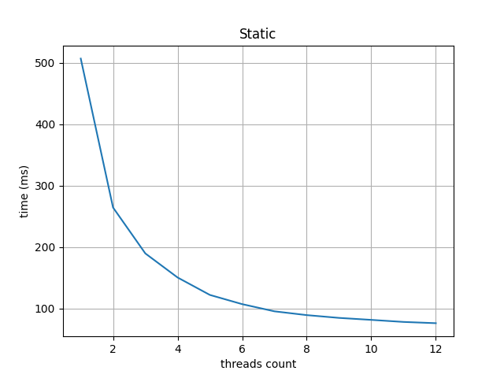
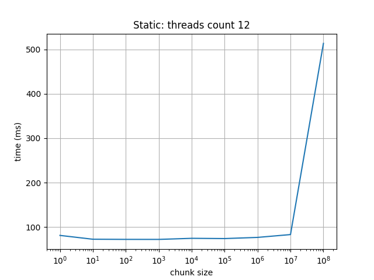
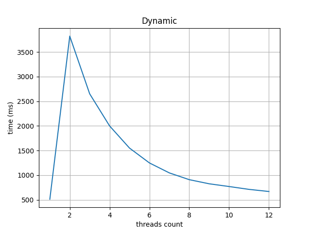
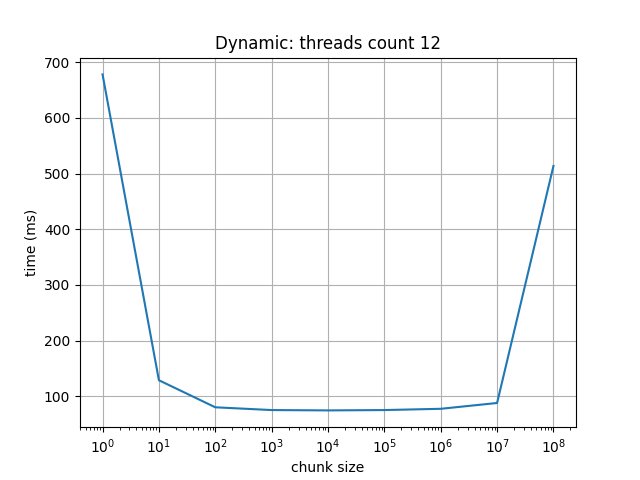

| Лабораторная работа №4 | M3102                            | АОВС |
| ---------------------- |----------------------------------| ---- |
| OpenMP                 | Лебединский Михаил Станиславович | 2024 |


## Инструментарий

c++20

Процессор: Intel Core i5 12450H; 8 ядер(4 энергоэффективных) 12 потоков

## Результат работы на тестовых данных: [ссылка на последний успешный action с актуальными данными](https://github.com/skkv-itmo-comp-arch/se-comp-arch24-omp-MikhailLebedItmo/actions/runs/9439348776)

# Описание:

## Результат работы программы:

Процессор: Intel Core i5 12450H; 8 ядер(4 энергоэффективных) 12 потоков

Программа запускалась с параметром schedule - static.
Количество потоков: 12.
Число итераций: 1e8.

Результаты:

| volume | time(ms) |
|---|----------|
| 1.25373  | 76       |


## Описание конструкций OpenMP для распараллеливания команд

Было использованною три инструкции:

1) `#pragma omp parallel num_threads(thread_count)` - указывает блок кода,
который будет выполняться параллельно. Указываем количество, которое будет использовать программа.
Внутри него создаём rand-генератор и ссылку на счётчик соответсвующий одному конкретному потоку.
2) `#pragma omp atomic` - делает выражение после себя атомарным. Нужно для того что-бы можно было менять
   одну и ту же переменную в разных потоках.
3) `omp_get_wtime()` - возвращает `double` - количество секунд прошедшего с 
какого-то времени в прошлом(это "время в прошлом" не изменяется во время выполнения программы).
4) `#pragma omp for schedule (<type>, <chunk_cnt>)` - распараллеливает цикл.

`chunk_cnt` - размер блока(количество итераций). По умолчанию $1$ при dynamic, при static $\frac{n}{threads_cnt}$.

### type

[Документация](https://www.openmp.org//wp-content/uploads/cspec20.pdf) стр 93.

`static` - Хорошо подходит, когда каждая итерация _~одинаковое время_ и мощности ядер одинаковы. Статическое расписание характеризуется тем, что каждый поток
выполняет примерно такое же количество итераций, как и любой другой поток, и каждый поток
может самостоятельно определять назначенные ему итерации. Таким образом , для распределения работы
не требуется никакой синхронизации, и, исходя из предположения, что каждая итерация
требует одинакового объема работы, все потоки должны завершаться примерно в одно и то же время.

`dynamic` - Хорошо подходит, когда различные итерации требуют различного времени выполнения или 
ядра имеют разную мощность. Динамическое расписание характеризуется тем, что ни один поток не ожидает у
границы дольше, чем требуется другому потоку для выполнения его последней итерации. Это
требует, чтобы итерации назначались потокам по одной за раз по мере их доступности,
с синхронизацией для каждого назначения. Затраты на синхронизацию можно
уменьшить, указав минимальный размер блока k, превышающий 1, чтобы потокам
назначалось k за раз, пока их не останется меньше k. Это гарантирует, что ни один поток не будет ждать
у границы дольше, чем требуется другому потоку для выполнения своего последнего блока (не
более) k итераций.

## Описание работы написанного кода

На каждой итерации мы генерируем случайную точку, и проверяем находиться ли она в нашей фигуре.
Если да, то увеличиваем счётчик. В конце умножаем объём области в которой находиться фигура,
на процент попаданий.

rand() - не является потокобезопасным. А mt19937 слишком медленный.
Поэтому я написал свой генератор, XorShift64. Код был взят [отсюда](https://en.wikipedia.org/wiki/Xorshift)
Написан в виде функции, чтобы избежать лишних затрат на вызов методов класса.

```c++
float xor_shift_64_rand(uint64_t& seed) {
    seed ^= seed << 13;
    seed ^= seed >> 7;
    seed ^= seed << 17;
    return (uint32_t)seed / (float)0xFFFFFFFFu;
}
```

В начале определяем границы в которых находится фигура.

```c++
auto axis_range = get_axis_range();
auto x_min = axis_range[0];
auto x_diff = axis_range[1] - x_min;
auto y_min = axis_range[2];
auto y_diff = axis_range[3] - y_min;
auto z_min = axis_range[4];
auto z_diff = axis_range[5] - z_min;
```

Для каждого потока создаём свой счётчик, после выполнения цикла прибавляем его к общему
счётчику(используя `atomic`)

Также для каждого потока создаём свой сид для рандомного генератора. Он определяется 
как номер потока + константа

```c++
#pragma omp parallel num_threads(thread_count)
    {
        uint64_t seed = omp_get_thread_num() + 0xb7f2C5;
        uint64_t hit_counter = 0;
        // далее основной цикл
    }
```

В основном цикле делаем, то что было написано ранее.

```c++
#pragma omp for schedule(static)
    for (uint64_t i = 0; i < n; ++i) {
        Cords coords{generator.rand() * x_diff + x_min
                     , generator.rand() * y_diff + y_min
                     , generator.rand() * z_diff + z_min};
        hit_counter += hit_test(coords.x, coords.y, coords.z);
    }
#pragma omp atomic
    hit_cnt += hit_counter;
```

Объём фигуры высчитываем так.

```c++
(float)hit_cnt / n * (x_diff * y_diff * z_diff)
```

## Тестирование

Все тесты проходились при числе итераций `1e8` и уровне оптимизации `-O2`. 

**Static `chunk_size` по умолчанию**

| ThreadsCnt | Time(ms) |             
|------------|----------|
| 1          | 507      |
| 2          | 265      |
| 3          | 190      |
| 4          | 150      |
| 5          | 122      |
| 6          | 107      |
| 7          | 95       |
| 8          | 90       |
| 9          | 85       |
| 10         | 82       |
| 11         | 78       |
| 12         | 76       |



**Static with default ThreadCnt = 12**

| ChunkSize | Time(ms) |             
|-----------|----------|
| 1         | 81       |
| 1e1       | 73       |
| 1e2       | 72       |
| 1e3       | 72       |
| 1e4       | 74       |
| 1e5       | 74       |
| 1e6       | 76       |
| 1e7       | 83       |
| 1e8       | 513      |



В целом видно, что параметр не влияет на скорость работы. 
Кроме крайних случаев когда он слишком большой, тогда просто не все 12 потоков
работают.


**Dynamic with default chunk size**

| ThreadsCnt | Time(ms) |             
|------------|----------|
| 1          | 513      |
| 2          | 3822     |
| 3          | 2651     |
| 4          | 2000     |
| 5          | 1550     |
| 6          | 1248     |
| 7          | 1046     |
| 8          | 910      |
| 9          | 826      |
| 10         | 770      |
| 11         | 712      |
| 12         | 669      |



Минимальное время достигается при всего одном потоке. Это из-за того что при chunk size = 1. Основное время уходит на 
менеджмент потоков(поиск свободного блока).

**Dynamic with default ThreadCnt = 12**

| ChunkSize | Time(ms) |             
|-----------|----------|
| 1         | 678      |
| 1e1       | 128      |
| 1e2       | 80       |
| 1e3       | 75       |
| 1e4       | 75       |
| 1e5       | 75       |
| 1e6       | 77       |
| 1e7       | 87       |
| 1e8       | 514      |



Вначале при увеличении ChunkSize падает время выполнения программы. Так как меньше ресурсов тратится
на менеджмент потоков(реже приходиться искать свободный блок, так как сами блоки становятся больше).
После определённой точки время перестаёт меняться. При ChunkSize = 1e7 будет работать только 10 потоков(на остальные
не хватит итераций). Когда chunk size равен числу итераций 1e8 работает только один поток,
по времени работы это видно.

**Без omp**

Time: 492 ms

Итого для нашей задачи лучше всего подходит static при максимально возможном
количестве потоков(доступном на машине), с дефолтными параметрами. Так как каждая
итерация цикла у нас занимает примерно одинаковое количество времени.
